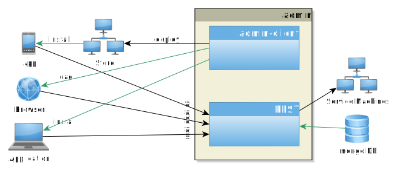

# Introduction

The administration panel should be an easy and fast way to manage IT systems for technical and non technical staff.

It is a universal control interface which can become real powerful by adding modules for special tasks. This modules will interact with the real systems in a proper and safe way. The user has no direct control but the limited functionality like defined in the module.

